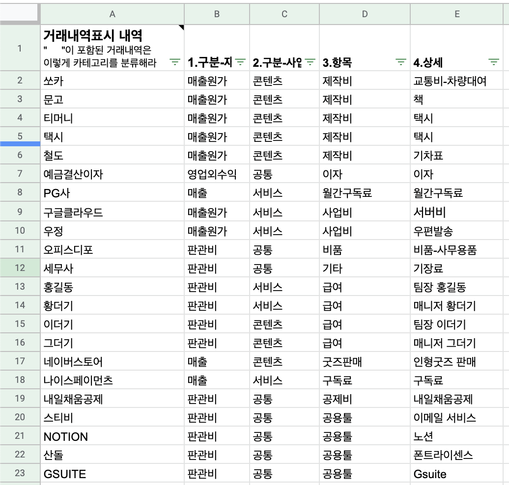
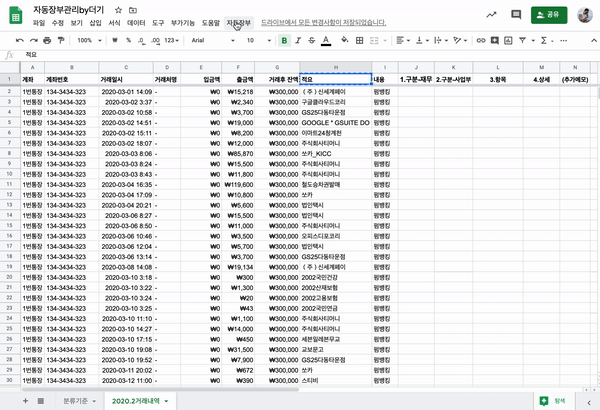
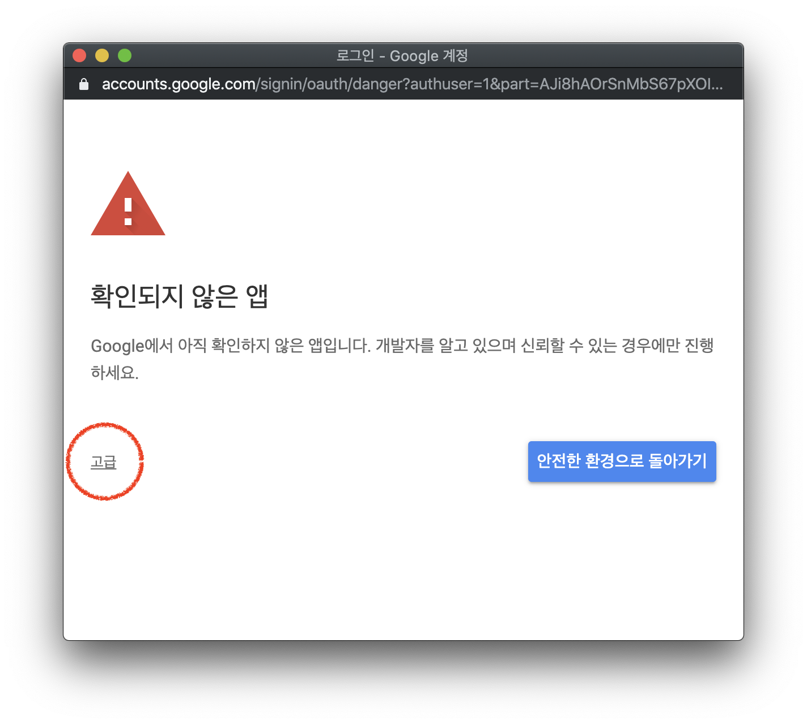
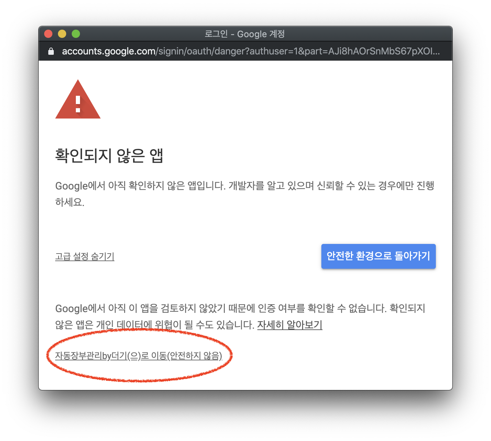
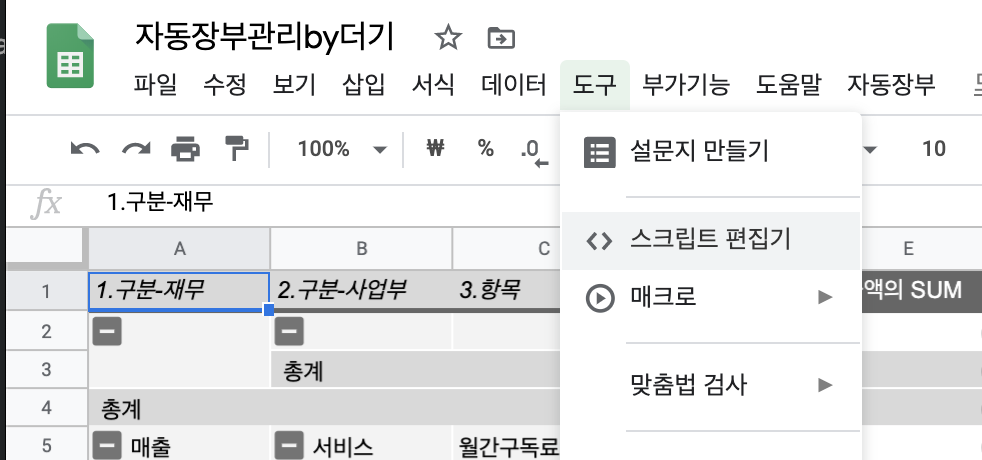

# 자동 장부 관리하기 w/스프레드시트

Created: Apr 30, 2020 2:41 PM
Status: 2 작성중
태그: Apps Script

매월 말이면 해야하는 장부정리는 고통입니다.
몇백 개의 거래내역을 보고 이게 어느 사업의 비용인지, 매출인지 구분하고 정리해야 하죠.

장부정리는 귀찮다고 또 대충하면 안됩니다. 사업의 원가를 제대로 계산해야 사업적으로 의미있는 숫자를 만들 수 있습니다. 장부정리가 안되면 원가 계산도, 영업이익률을 제대로 계산할 수 없습니다.

이 **중요하고 귀찮은** 일을 정확하게 처리할 수 있게 자동화 해봅시다! 빠샤! 

### 이렇게 기획을 했습니다.

통장거래내역 파일에서 각 거래내역이 [어떤 사업부- 어떤 항목]인지 자동으로 기록되게 하는거죠. 먼저 1) 내가 원하는 구분 기준을 만들고. 2)통장에 찍힌 적요에 따라 자동으로 분류된 내역이 기록되게 만들었습니다.



1 분류기준을 만들면



2 분류기준에 맞게 통장거래 내역을 자동장부정리 해주고


3 피봇해서 재무표로 만들어준다

# ☝🏻1 사용법

### [샘플 스프레드 시트(링크)](https://docs.google.com/spreadsheets/d/1gXOc6WjDkha-ubpZ_TrcRWcd0hnnvQbBXspoa-a496U/edit?usp=sharing)

샘플 스프레드시트를 만들었습니다. **사본으로 만들어서** 수정 후 사용하시면 됩니다.

1) [시트 접속하기](https://docs.google.com/spreadsheets/d/1gXOc6WjDkha-ubpZ_TrcRWcd0hnnvQbBXspoa-a496U/edit?usp=sharing)

2) [파일>사본 만들기]로 내 파일로 만들어주기

## 1. <분리기준>시트

먼저 내가 원하는 <분리기준>을 만듭니다. 현재 규칙에서는 이런식으로 작동합니다.

'GS25'라는 단어가 '거래내역 열' **포함되면** 찍히면 자동으로 → [판관비 > 공통 > 간식/식비 > 간식] 으로 분류한다.

'Gsuite'라는 단어가 '거래내역 열' **포함되면** 찍히면 자동으로 → [판관비 > 공통 > 공용툴 > Gsuite] 으로 분류한다.


<분리기준>시트대로 장부가 정리됩니다. 여러분이 원하는 대로 이 시트를 바꿔서 사용하시면 됩니다. 
현재 짜놓은 함수는 [1.재무구분 2.사업부구분 3.항목 4.상세] 이렇게 4개 층위로 구분하도록 짜여져있습니다. 구분하고자 하는 단계를 5개 이상으로 늘리고 싶으면 코드를 수정해야합니다 

## 2 <거래내역>시트

<2020.2 거래내역>에 찍힌 '**적요'열** 에 있는 단어를 보고 <분리기준>에 따라 자동으로 장부를 정리해줍니다. 

상단 바에서 [자동장부>장부정리] 클릭해보세요.


### ⚠️ 권한 요청

최초실행시 앱스크립트 코드가 내 스프레드시트를 수정할 수 있도록 권한 승인을 해줘야합니다.

권한을 모두 승인한 후에 한번 더 상단 바에서 실행하기 원하는 함수를 클릭해주세요!







## 3. <피봇테이블>로 재무표 만들기

<거래내역>시트를 보기 쉬운 재무표로 만들어준다. 

해당월의 장부정리가 끝났으면 상단 바에서 [자동장부>피봇테이블] 클릭해주세요.


# 📝 2 코드 설명

앱스크립트 코드를 보려면? → [도구>스크립트 편집기]

주의! 앱스크립트는 Gusite 계정에서만 사용할 수 있습니다. 일반 gmail 계정에서는 편집할 수 없습니다



[자동장부관리by더기] 스프레드시트랑 연결된 앱스크립트 파일에는 총 3개 스크립트파일이 있습니다

- 1) menu.gs : 상단 바에 [자동장부]메뉴를 만들기 위한 스크립트
- 2) autoCategorize : 자동 장부정리 함수를 작성한 스크립트
- 3) pivoting : 자동 피봇 함수를 작성한 스크립트

### menu.gs

```jsx
//커스텀 메뉴를 만들기 위한 함수입니다.

function onOpen() { //스프레드시트가 열리면 아래 함수를 실행해라
  var ui = SpreadsheetApp.getUi(); //스프레드시트 UI객체 가져오기
  ui.createMenu("자동장부") //"자동장부"라는 메뉴를 만들고
    .addItem("장부정리", "autoCategorize") //"장부정리"버튼을 만들고 - 'autoCategorize'라는 함수랑 연결한다
    .addItem("피봇테이블", "pivoting") //"장부정리"버튼을 만들고 - 'pivoting'라는 함수랑 연결한다
    .addToUi(); //UI에 추가한다.
}
```

### autoCategorize.gs

```jsx
//autoCategorize 함수
function autoCategorize() {
  //<분류기준> 시트 가져오기
  var SS = SpreadsheetApp.getActive(); //현재 활성화된 스프레드시트 가져오기
  var sheetRule = SS.getSheetByName("분류기준"); //분류기준이 되는 시트 "분류기준" 가져오기
  var rangeRule = sheetRule.getDataRange();
  var valueRule = rangeRule.getValues();
  
  //<월 거래내역> 시트 가져오기
  var sheetMonth = SpreadsheetApp.getActiveSpreadsheet(); //현재 열려있는 시트를 가져온다. 
  var rangeMonth = sheetMonth.getDataRange(); 
  var valueMonth = rangeMonth.getValues();
  

  for(j = 0; j < valueMonth.length; j++){
    valueOfPaydata = valueMonth[j][7] + ""; 
    //string으로 바꿔줘야함. 
    //includes()매소드는 는 string만 인식가능한데
    //for loop에서 function을 돌리는 건 num를 돌리는 것이기 때문에. -> string으로 바꿔줘야함
  
    for(r = 1; r < valueRule.length; r++){ //맨위 행은 실행하지 않도록 
      if(valueOfPaydata.includes(valueRule[r][0])){ 
        valueMonth[j][9] = valueRule[r][1]; // B열 [1.구분-재무] 채워주기
        valueMonth[j][10] = valueRule[r][2]; // C열 [2.구분-사업부] 채워주기
        valueMonth[j][11] = valueRule[r][3]; // D열 [3.항목] 채워주기
        valueMonth[j][12] = valueRule[r][4]; // E열 [4.상세] 채워주기
      } 
    }
  }
  rangeMonth.setValues(valueMonth);  //값을 시트에 입력해주자
}
```

# 3 Apps Script 기본기

위에 코드가 무슨 말인지 모르겠다면 기본기는 배우고 넘어가는 것이 좋습니다. 저도 막 보고 따라하는 것보다 Apps Script 기본 함수들에 익숙해지니까 만드는데 시행착오가 훨씬 덜 했습니다. 

### 먼저 스프레드시트 구조를 알아야합니다.

스프레드시트 파일 1개는 이런 구조로 이루어져있습니다.

[스프레드시트 파일] - [시트] - [Range] - [Value]

- 스프레드시트 파일 : 1개 이상의 시트로 구성된 파일. 구글 드라이브에서 파일 1개
- 시트 : 테이블 1개
- Range : 영역. 우리가 드래그해서 선택하는 것처럼 
ex) A1:B3 = 1행1열 부터 3행2열까지
- Value : range(영역)안에 들어 있는 값

Q. 스프레드시트 ID는 어떻게 찾나요?

```html
https://docs.google.com/spreadsheets/d/**1gXOc6WjDkha-ubpZ_TrcRWcd0hnnvQbBXspoa-a496U**/edit#gid=**1233874511**

스프레드시트 ID = 1gXOc6WjDkha-ubpZ_TrcRWcd0hnnvQbBXspoa-a496U
시트ID = 1233874511
```

스프레드시트 구조에 맡게 하나씩 접근하고 데이터를 가져오려면 한 단계씩 접근해야합니다.

```jsx
//1 스프레드시트 접속
var SS = SpreadsheetApp.openById("URL에나온스프레드시트ID");
//2 원하는 시트에 접속
var sheet = SS.getSheetByName("시트이름");
//3 시트에서 영역 선택
var range = sheet.getDataRange();
//4 선택한 영역 안에 있는 값들 -> 2차원 데이터로 가져오게됨
var value = range.getValues();

//value[0][0] = 1행1열 셀에 잇는 값
//value[2][5] = 3행6열 셀에 있는 값

//한번에 시트를 선택하고 싶으면 이런식으로도 가능함.
//현재 열려있는 '시트'선택
var sheet = SpreadsheetApp.getActiveSpreadsheet(); 
var range = sheet.getDataRange();
var value = range.getValues();
```

### 더 공부하기

App Script 튜토리얼은 이게 개짱입니다!시간 정도면 학습할 수 있는데 Apps Script꾸준히 해보고 싶다면 꼭 해봅시당! →  [https://developers.google.com/apps-script/quickstart/fundamentals-codelabs](https://developers.google.com/apps-script/quickstart/fundamentals-codelabs)

